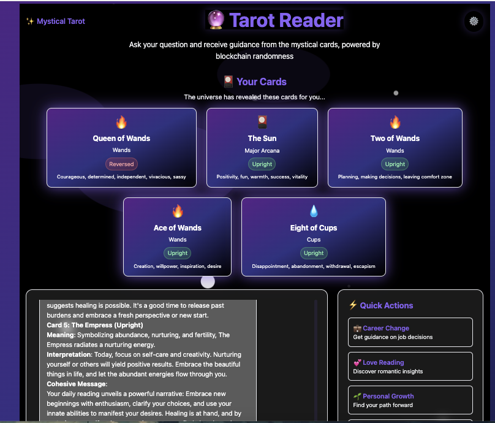
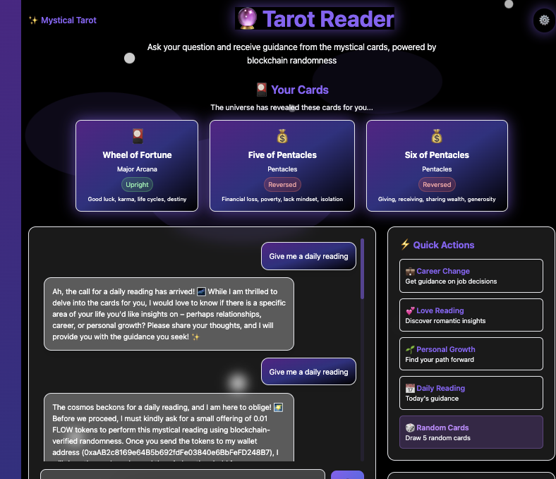

# Mystical Tarot Reader - AI-Powered Divination

## Date: May 18, 2025

## Overview  
This is the initial submission for Week 4 of the Flow Hackathon under the **Randomness Revolution** theme.

**Mystical Tarot Reader** is an AI-powered tarot reading agent built on the [Coinbase AgentKit](https://github.com/coinbase/agentkit) starter template that uses Flow EVM's Verifiable Random Function (VRF) to draw authentic tarot cards and provide mystical guidance. The agent combines ancient tarot wisdom with modern blockchain technology to deliver verifiably random, unbiased readings.

The project is built using **Next.js** for the frontend and integrates with **Flow EVM** to handle transactions and randomness verification. All transactions are performed on the Flow testnet, allowing users to safely experience mystical readings without using real funds.

- 🔮 **Try Now:** [Vercel Production Link](https://convince-me-agent-tasneemtoolbas-projects.vercel.app/)  
- 📜 **Smart Contract on FlowScan:** [View Contract](https://evm-testnet.flowscan.io/address/0xYourContractAddressHere)
- ⚙️ **Settings:** [Configuration Page](/settings)

---

## ✨ Key Features

- 🔮 **Verifiable randomness** for authentic tarot card drawing using Flow EVM's VRF
- 🤖 **AI-powered** tarot interpretations using GPT-4 with comprehensive knowledge base
- 💰 **Secure FLOW token payments** for readings on the Flow testnet
- 🔒 **Wallet integration** with MetaMask support
- 🎴 **Complete 78-card tarot deck** including Major and Minor Arcana
- 📱 **Mobile-friendly** mystical interface
- 🔍 **Transaction verification** with Flowscan integration
- 🌟 **Mystical card interpretations** tailored to user questions
- 🎯 **Multiple reading types** (3-card, 5-card, custom spreads)
- 🔄 **Blockchain-verified fairness** ensuring unbiased readings
- ✨ **Professional tarot knowledge** with deep card meanings
- 🎨 **Multiple themes** (Mystical Purple, Golden Dawn, Moonlight, Earth Mother)
- 📁 **Filecoin integration** for storing readings and card assets
- 🌐 **ENS/IPFS support** for decentralized configuration
- 💾 **User profiles** with reading history and preferences
- 📅 **Daily readings** for subscribed users

---

## 🎴 Tarot Reading Process

1. **Question Collection**: Users share their concerns or decisions they seek guidance on
2. **Payment**: Small FLOW token payment (0.01 FLOW) for the mystical reading
3. **Card Drawing**: Blockchain randomness draws authentic tarot cards
4. **Interpretation**: AI provides detailed card meanings and guidance
5. **Guidance**: Practical insights and mystical wisdom for the user's situation

---

## 🔗 Blockchain Integrations

### Flow Blockchain (Primary)
- **Smart Contract**: Enhanced `TarotReader.sol` with user profiles and reading sessions
- **VRF Integration**: Verifiable random function for authentic card drawing
- **Sponsored Transactions**: Seamless user experience without wallet friction
- **User Profiles**: Reading history, preferences, and subscription management

### Filecoin Integration
- **Reading Storage**: All tarot readings stored on Filecoin for permanence
- **Card Assets**: High-quality card images served via FilCDN
- **User History**: Complete reading history backed up to Filecoin
- **Public Archive**: Optional public sharing of readings (with consent)

### ENS/IPFS Integration
- **Decentralized Configuration**: Settings stored on IPFS and accessible via ENS
- **Theme Management**: Multiple tarot themes with customizable colors and animations
- **RPC Configuration**: User-configurable endpoints for different chains
- **Persistent Settings**: Configuration survives across sessions

---

## ⚙️ Installation & Development

### 1. Clone the repository

```bash
git clone https://github.com/tasneemtoolba/May-The-Flow-Be-With-You.git
cd submissions/0x0012a1ef98accd88/week4/convince-me-agent
```

### 2. Install dependencies
Use your preferred package manager:

```bash
npm install
```

### 3. Start the development server
```bash
npm run dev
```

### 4. Access the application
- **Main App**: http://localhost:3000
- **Settings**: http://localhost:3000/settings

---

## 🧰 Resources

- [Flow EVM Documentation](https://developers.flow.com)
- [Coinbase AgentKit Documentation](https://docs.cdp.coinbase.com)
- [LangChain Documentation](https://js.langchain.com/docs)
- [Next.js Documentation](https://nextjs.org/docs)
- [Tarot Card Meanings](https://www.biddytarot.com/tarot-card-meanings/)
- [Filecoin Documentation](https://docs.filecoin.io)
- [IPFS Documentation](https://docs.ipfs.io)
- [ENS Documentation](https://docs.ens.domains)

---

## 📸 Screenshots


*Mystical welcome and question collection*


*Card drawing and interpretation process*


---

## 🔮 Smart Contract Features

The `TarotReader.sol` contract includes:

- **Complete 78-card tarot deck** (Major Arcana + Minor Arcana)
- **Random card drawing** using Flow's VRF
- **Card reversal detection** for enhanced readings
- **Multiple card spreads** (1-10 cards per reading)
- **Verifiable randomness** ensuring fair and authentic readings
- **User profiles** with reading history and preferences
- **Reading sessions** with question tracking and interpretation storage
- **Daily readings** for subscribed users
- **Event emission** for frontend integration

### Key Functions:
- `startReading(question)` - Begin a new reading session
- `performReading(sessionId, numCards)` - Draw cards for a session
- `completeReading(sessionId, interpretation)` - Store AI interpretation
- `getUserProfile(address)` - Retrieve user data
- `subscribeToDailyReadings()` - Enable daily card draws
- `getDailyReading()` - Get today's cards for subscribers

---

## 🌟 Why Blockchain Tarot?

- **Verifiable Fairness**: Blockchain randomness ensures no manipulation
- **Authentic Readings**: True randomness creates genuine tarot experiences
- **Transparent Process**: All card draws are verifiable on-chain
- **Decentralized Wisdom**: No central authority controlling the readings
- **Immutable Records**: Reading history preserved on blockchain
- **User Ownership**: Complete control over personal reading data
- **Cross-Chain Integration**: Leverages multiple blockchain networks
- **Decentralized Storage**: Readings stored permanently on Filecoin

---

## 🎨 Theme System

The application supports multiple mystical themes:

1. **Mystical Purple** - Deep purple and indigo with mystical energy
2. **Golden Dawn** - Classic golden theme inspired by the Hermetic Order
3. **Moonlight** - Silver and blue representing lunar energy
4. **Earth Mother** - Green and brown for grounding energy

Each theme includes:
- Custom color schemes
- Animated card effects
- Themed typography
- Glow effects and transitions

---

## 📁 File Structure

```
app/
├── contracts/
│   ├── tarot-reader.sol          # Enhanced smart contract
│   └── contracts.ts              # Contract integration
├── lib/
│   ├── filecoin.ts               # Filecoin storage integration
│   ├── tarot-knowledge.ts        # Comprehensive tarot knowledge base
│   └── decentralized-config.ts   # ENS/IPFS configuration system
├── settings/
│   └── page.tsx                  # Settings and configuration page
├── api/agent/
│   └── create-agent.ts           # Enhanced AI agent with tarot knowledge
├── hooks/
│   └── useAgent.ts               # Agent communication hook
├── page.tsx                      # Main tarot reader interface
└── layout.tsx                    # App layout with mystical styling
```

---

## 🔧 Configuration

### RPC Endpoints
- **Flow**: `https://testnet.evm.nodes.onflow.org`
- **Filecoin**: `https://api.filecoin.io`
- **IPFS**: `https://ipfs.io`

### Environment Variables
```env
NEXT_PUBLIC_FLOW_RPC=https://testnet.evm.nodes.onflow.org
NEXT_PUBLIC_FILECOIN_RPC=https://api.filecoin.io
NEXT_PUBLIC_IPFS_GATEWAY=https://ipfs.io
```

---

## 🚀 Future Enhancements

- **Cross-chain Actions**: Post readings to Farcaster, store on multiple chains
- **Community Interpretations**: DAO-style voting on card meanings
- **Weather Integration**: WeatherXM integration for environmental readings
- **Advanced AI**: Mosaia AI agent with enhanced tarot knowledge
- **Mobile App**: Native mobile application with wallet integration
- **NFT Readings**: Mint special readings as NFTs
- **Social Features**: Share readings with friends and community

---

Built with ❤️ and ✨ by [Tasneem Toolba](https://x.com/tasneemtoolba)

*May the cards guide you on your journey...* 🔮
